# NU Hotel Booking App 🏨

## About The Project
NU Hotel Booking App is an iOS application developed using SwiftUI and Firebase technologies, designed to provide a seamless hotel room booking experience. The app offers an intuitive interface for users to browse, select, and book hotel rooms.

## App Screenshots

    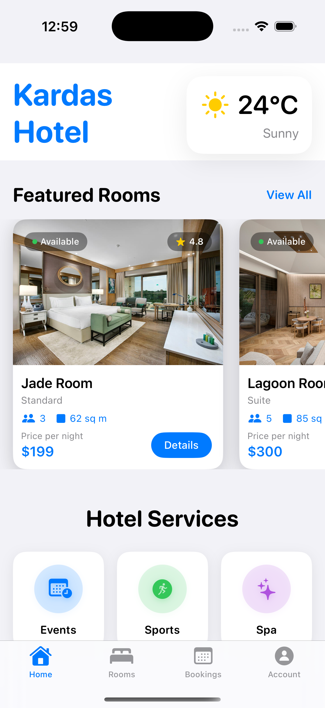
    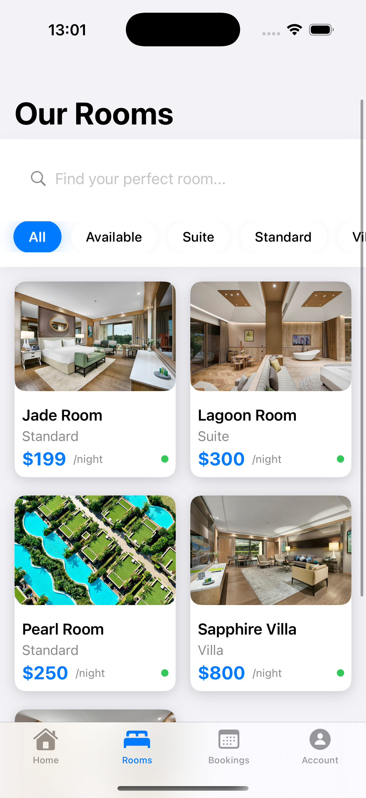
    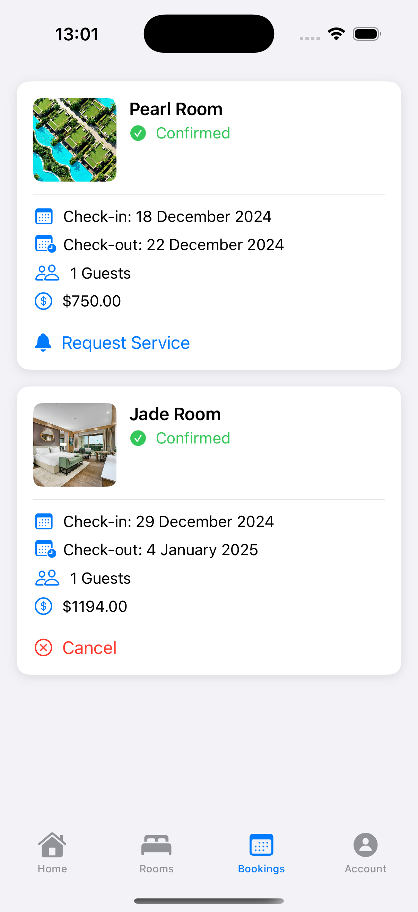
    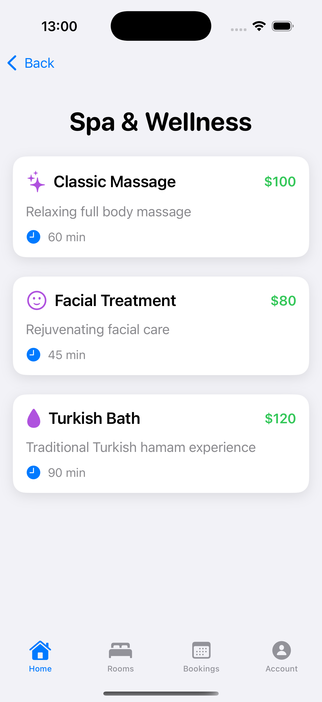
    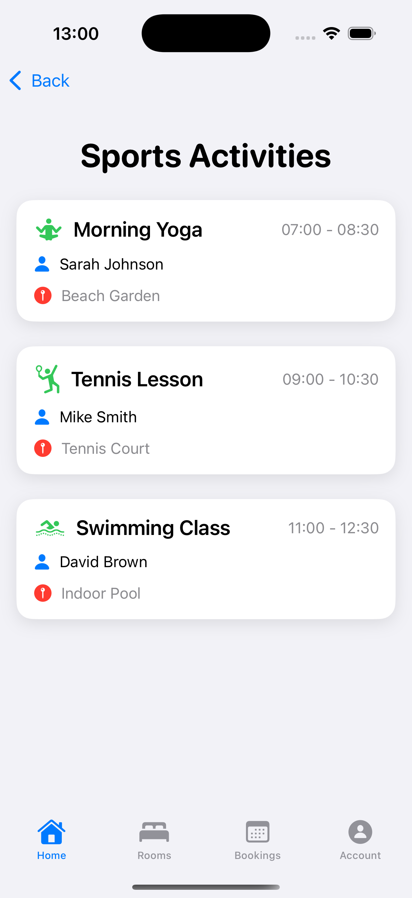
    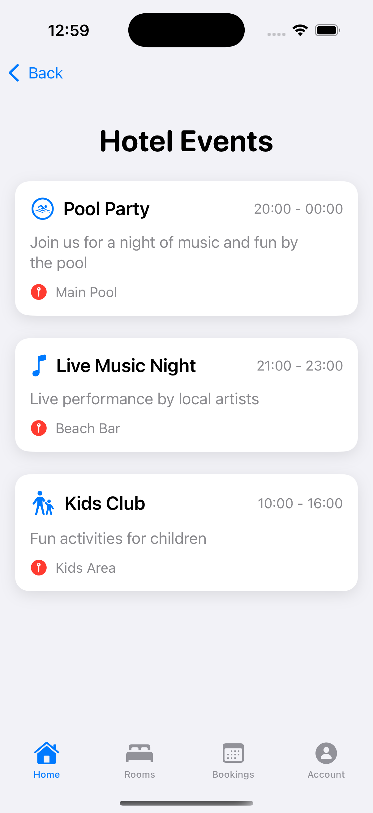
    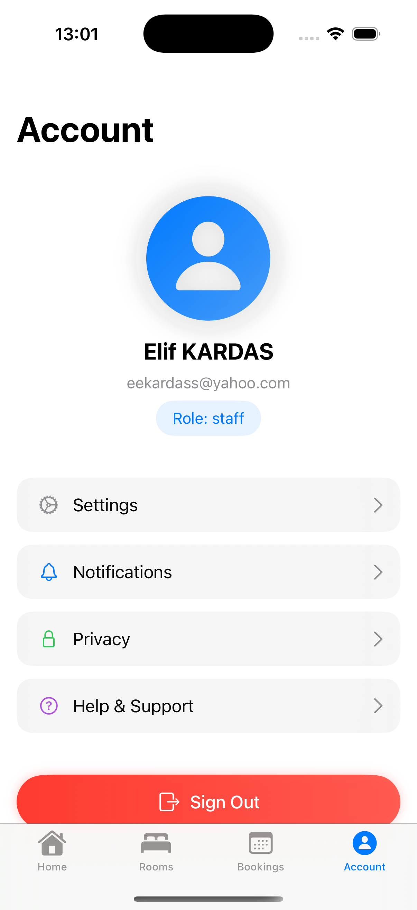
    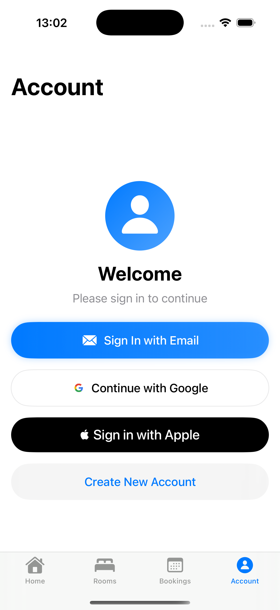
    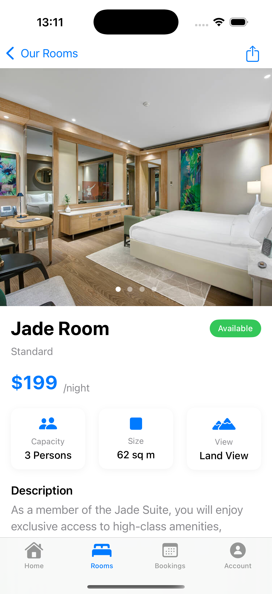
    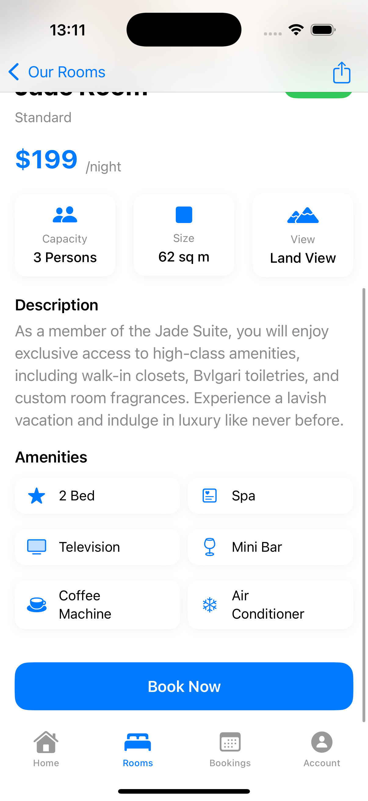
    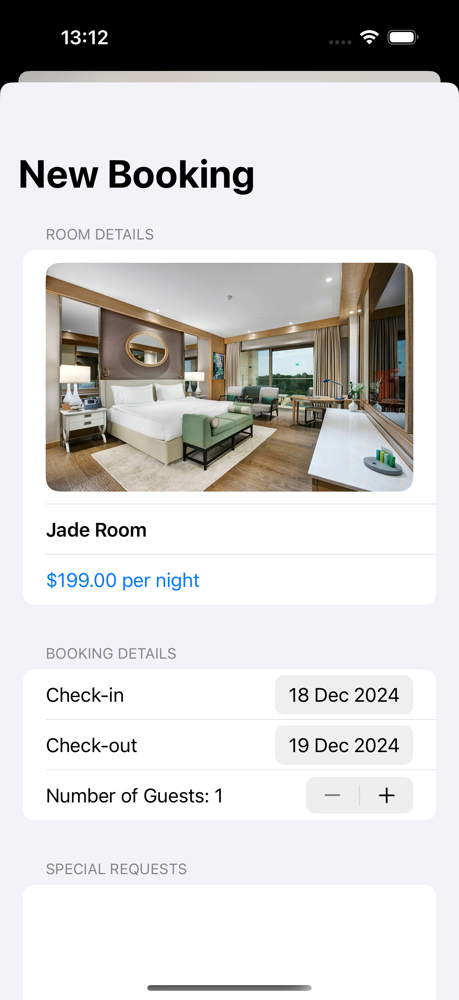
    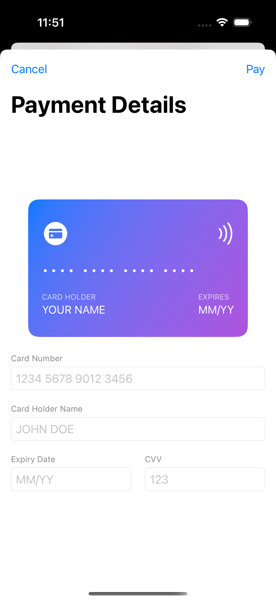

## Features
- 📱 Modern SwiftUI interface
- 🔥 Real-time data synchronization with Firebase
- 🏷️ Room browsing and booking
- 📅‍♀️ Spa services viewing
- 🏋️‍♂️ Sport facilities information
- 🎭 Event browsing
- 👤 User account management
- 📅 Booking management
- 🔐 Secure user authentication
- 📱 Responsive design for various iOS devices

## Technical Requirements
- iOS 15.0 or later
- Xcode 13.0 or later
- CocoaPods

## Technologies Used
- SwiftUI
- Firebase
  - Firebase Authentication
  - Firebase Realtime Database
  - Firebase Storage
- Swift Package Manager
- Combine Framework
